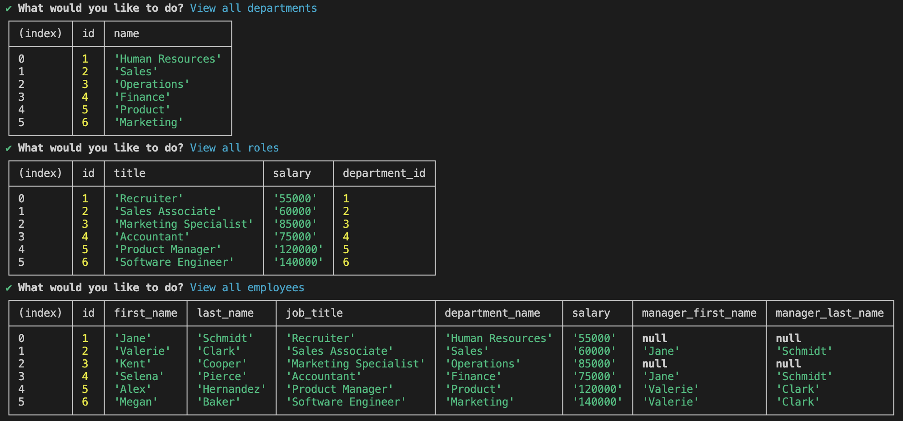

# Employee Tracker
This is a command line application content management system that allows users to manage their company's employee database, using Node.js, Inquirer, and PostgreSQL.

## Application

The following walkthrough video [here](https://drive.google.com/file/d/1frg6lkdvDkrrSCbI-d-a99tZ-YY7e1C2/view) shows an example of the application being used from the command line. 


## Table of Contents
* [Features](#features) 
* [Installation](#installation)
* [Usage](#usage)
* [License](#license)
* [Contributing](#contributing)
* [Contact Information](#contact-information)

## Features
* Interactive Command Line Interface: A user friendly and intuitive CLI with guided prompts that let you manage data.
* View Data: A display list of all departments, roles, and employees in the organization.
* Add Entries: Ability to insert new departments, roles, and employees into the database to keep up to date records.
* Update Records: Ability to modify employee roles to reflect changes in responsibilities or promotions.

## Installation
For installation of this application you will need to: 
1. Fork the repo to your local machine

2. Navigate to the project directory

3. Install the necessary dependencies using:
  ```
  npm install
  ```
  * This application uses: 
    * The pg package to connect to PostgreSQL database
    * The inquirer package for user interaction with the command line
    * The dotenv package to hide sensitive data for database connection

4. Set up the database:
* Ensure PostgreSQL is installed and running on your local machine
* Apply the database schema and seed data
  * Run the schema SQL file to create the relevant tables
    ```
    \i schema.sql
    ```
  * Run the seeds SQL file to populate the relevant tables
    ```
    \i seeds.sql
    ```
5. Run the application
  ```
  npm start
  ```
  * The command line application will launch and display the main menu with prompts for interaction. 

## Usage
Make the most of the Employee Tracker by using its key features to manage your company’s employee information more efficiently. From tracking roles, departments and employees, this application allows you to keep your organizations data up to date.

## License
This project is licensed under the ISC license.

## Contributing
Contributions welcome for this project! Feel free to fork the repository, make your changes, and submit a pull request.

## Contact Information
For any questions feel free to contact me on GitHub: celeste-hayes